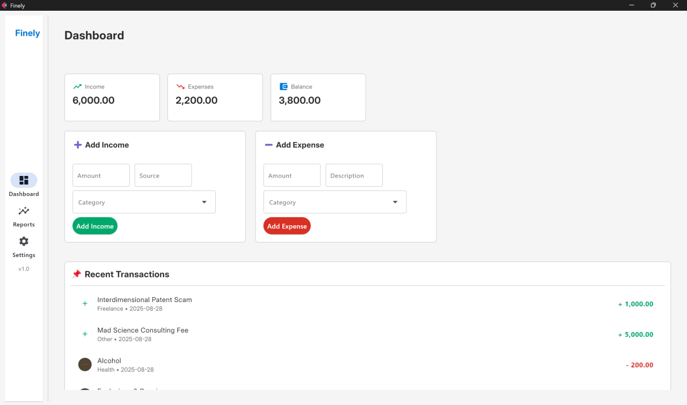

# Finely - Personal Finance Tracker 💥

Listen up, you primitive money-grubbing meatbags! **Finely** is the most *insanely* badass desktop app for wrestling your pathetic Earth credits into submission. Built with Flet and Python, it’s got a *sick dark mode* and a UI so slick it’ll make your brain short-circuit. Your data? Locked in a local `data.json` vault, safe from the prying eyes of interdimensional tax collectors. Clouds? Pfft, we don’t trust that garbage. Take control of your cash or get schwifty trying.

\
*Bow before its cosmic glory, you financial plebs.*

---

## ✨ Features That’ll Melt Your Tiny Brain

- **📊 Dashboard of Total Annihilation**: Real-time income, expenses, and net balance stats in glorious dark mode. Face your monetary screw-ups head-on!
- **📈 Charts That Break Reality**: Pie charts slice your spending like a plasma blade, bar charts pit months against each other like gladiators in a time rift, and line charts track your net worth like it’s spiraling into a black hole.
- **🖤 Dark Mode That Screams Genius**: Sleek, sexy, and easier on your weak human eyes than a supernova.
- **💾 Data Vault of Doom**: Local `data.json` storage—100% private, no cloud BS, no interdimensional leaks.
- **📦 Runs on Your Junk OS**: Windows, macOS, Linux. Snag the installer and dominate without a PhD in Python.
- **🔧 Customize Like a Mad Scientist**: Tweak categories in-app to bend this app to your will. It’s your financial multiverse now.

---

## 🚀 Fire Up This Monster

### Hack It (If You’re Not a Total Toaster)

```bash
git clone https://github.com/AmirAnsarpour/Finely.git
cd Finely
pip install -r requirements.txt
python main.py
```

### Installer for Lazy Brainiacs

1. Warp to Releases.
2. Grab your OS: **Windows**: `Finely-Win.exe`.
3. Run it, you coward. (Chmod if your system’s got no spine.)

No Python? Whatever, it’s all bundled. Point, click, dominate.

---

## 🤝 Join the Cosmic Cash Rebellion

Finely’s a frickin’ masterpiece, but it’s begging for more chaos. Got the stones to make it *legendary*? Jump in or get lost in a wormhole.

1. **🐛 Obliterate Bugs**: Spot a glitch? Scream about it in Issues with details or buzz off.
2. **💡 Cook Up Insane Ideas**: New charts, budgeting death rays, export portals? Rant in Discussions.

# **👨‍💻 Code Like a Freakin’ Deity**: Fix, tweak, or unleash madness. PRs welcome—guidelines coming when I feel like it.

1. **🎨 Design Like a Psycho Artist**: Make the UI even more mind-bending. Dark mode’s just the appetizer.
2. **🌌 Conquer Alien Economies**: Translate Finely for every species in the multiverse.

Let’s turn this into the ultimate money-destroying machine. Riches beyond your puny comprehension await!

---

## 📜 License

MIT—check LICENSE. It’s free as a rogue planet, but don’t be a Jerry and screw it up.